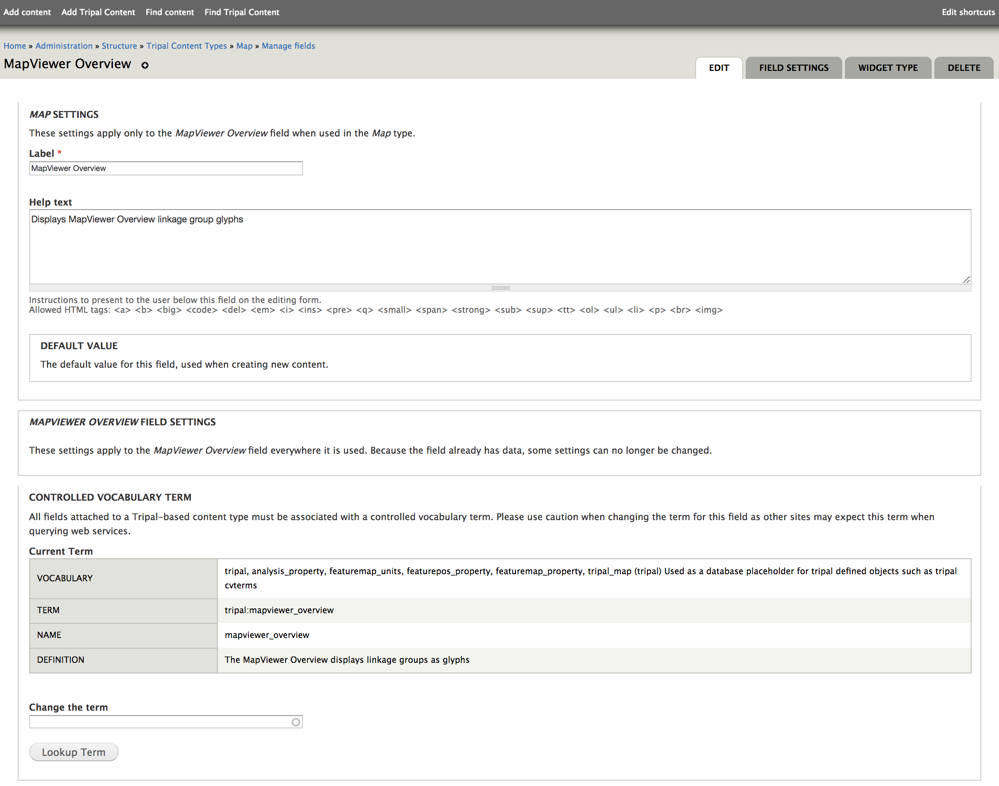
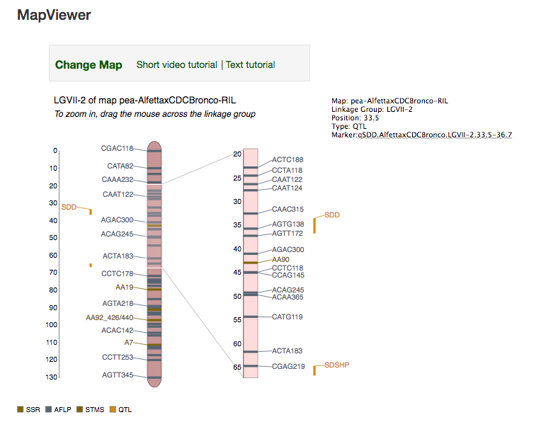

#  Contents 
 * Introduction
 * Requirements
 * Version
 * Download
 * Installation
 * Configuration
 * Use Cases
 * Problems/Suggestions
 

# Introduction
TripalMap is a Drupal module that provides interactive visualization of genetic maps.
The TripalMap module extends the Tripal suite of Drupal modules and can be added to any 
website that uses Tripal, where genetic map visualization functionality is desired.

Representing the next generation of the existing CMap tool, TripalMap MapViewer is a browser based
tool for visualizing comparison of genetic maps from numerous species, and curating
map data. 

The TripalMap MapViewer provides a modernized user interface to display chromosomes of
different species and view pair-wise comparisons of known correspondences of genetic
map features. The TripalMap module integrates with Drupal websites using the Tripal API and Chado
tables from a PostgreSQL database.  


# Requirements
* Drupal 7.x
* Tripal 7.x-2.x or Tripal 7.x-3.x

## Install Drupal

Please refer to this [page](http://tripal.info/tutorials/v2.x/installation/drupal) to install Drupal.

## Install Tripal 

Please refer to this [page](https://https://www.drupal.org/project/tripal) and 
[here](http://tripal.info/tutorials/v2.x/installation/tripal) to install Tripal v2 or
[here](http://tripal.info/tutorials/v3.x/installation/tripal) to install Tripal v3.


# Version

1.0.0


# Download

The TripalMap module can be downloaded from GitLab:
https://gitlab.com/mainlabwsu/tripal_map


# Installation

1. Install the tripal_map module on your Tripal site


2. Configure the Materialized views:

* Go to the Tripal menu and choose the Chado Schema option. Then select Materialized Views.
* In the Materialized Views page, find the tripal_map_genetic_markers_mview materialized view 
and select "populate" in the right column
* Populate the tripal_map_qtl_and_mtl_mview also. This submits the job to populate the materialized views.
* Use drush to manually run the job to populate the materialized views:

```
cd /var/www/html
drush trp-run-jobs --user=administrator
```
* Refresh the Materialized Views page and both materialized views should show a status of "populated".

3. Editing the Materialized Views:
* Depending on your specific Chado table naming scheme, it may be necessary to edit certain parts of 
the materialized views. 
* To do this go to Materialized Views page and choose the Edit option beside the tripal_map_genetic_markers_mview materialized
and tripal_map_qtl_and_mtl_mview. 
* You should not need to modify the schema, but in the query you may change the table names if they differ from your Chado naming scheme.
* For example, it is likely that in the tripal_map_genetic_markers_mview materialized view, in this statement 
on line cv_id = (SELECT cv_id FROM {cv} WHERE name = 'MAIN'), the name of the 
controlled vocabulary (cv) will be something different than 'MAIN'.

## Please Note:
1. On uninstall, any changes made to the materialized views will be deleted. 
2. When data in the Chado tables is updated, those changes are reflected by TripalMap only after re-populating 
the materialized views. 


# Configuration

For Tripal version 3, TripalMap offers two fields that can be added and configured, the MapViewer overview field and the MapViewer Marker Map Positions field:

## MapViewer Overview 

To add the Map Overview field to the Map page, visit the Structure option in the Drupal Administration and select the Tripal Content Types options. Select the Map content type:


In the Map content type page, add a new field by specifying the MapViewer Overview field type:


Create the MapViewer Overview field by completing the settings form as specified here:



## MapViewer Marker Map Positions

To add the Marker Map Positions field to the Genetic Marker, Heritable Phenotypic Marker or QTL markers, visit the Structure option in the Drupal Administration and select one of these Tripal Content Types:


Add a new MapViewer Marker Map Positions field in one of these marker content type pages and complete the settings form as specified here:

  


To configure aspects of TripalMap, visit the Administration page by going to the Tripal
menu, selecting the Extensions option and then choosing MapViewer.


## General Section
In the General section, the Tutorial Links manipulate the link values at the top of the MapViewer page. 
Changes in the Video and Text tutorial fields here in this dialog will be dynamically reflected in 
MapViewer Tutorial links.


## Toolbar Section
In the Toolbar section there are two settings, the Linkage Group Display and the Organism Selector Display Preferences.

### Linkage Group Display
The Linkage Group Display section controls the setting for whether or not marker names for 
QTL and heritable phenotypic markers are abbreviated. The abbreviated names appear beside the linkage group, 
and the full name appears on the marker label popup on the top right.



### Organism Selector Display Preference
The Organism Selector Display Preference specifies whether the common name or the genus and species name will be used to refer to the Organisms shown in the toolbar selector list. Here is an example of the Genus and Species:


the Common Name:


Or both the Common Name and the Genus and Species:


### In the Chado section the Marker position names for start, stop and qtl_peak position
can be customized here if a different terminology is used by the marker fields. The names in these 
fields are accessed dynamically and used in the code that determines the positioning of markers on the linkage groups.

# Use Cases

## Use Case 1: 
View the map from the Map Overview


Specify the map id in the URL path, for example, https://yoursite.org/featuremap/439 or navigate to it from a 
Drupal node.

## Use Case 2: 
View a linkage group from the MapViewer
Click on one of the glyphs in the Map Overview page or specify the map id in the URL path, 
and optional linkage group for example, https://yoursite.org/mapviewer/194/LG1, to open the MapViewer


## Use Case 3: 
Configure linkage group from MapViewer
Select an organism from the organism selector list, wait until the map and linkage group selection list options
are updated as dependencies.

or map from the map selector list, and wait until the linkage group selection list options are updated

or linkage group from the linkage group selector list. 


## Use Case 4: 
View correspondences between two linkage groups in the MapViewer
Select the "Show Comparison Map" checkbox. Two linkage groups will be drawn, the reference linkage group on the left, 
and the comparison linkage group on the right. Scroll the zoomed section on each linkage group to view various areas 
of each linkage group and adjust the orientation of the correspondences. 


## Use Case 5: 
Change color of markers in the MapViewer. In the Marker color toolbar, select a marker type, then a color and press Submit.
To default to original settings, click the Reset button.


## Use Case 6: 
Change marker type visibility in the MapViewer. In the Marker visibility toolbar, select one or more marker types, 
choose to Show or Hide the marker type(s) and press Submit. To default to original settings, press Reset.


# Problems/Suggestions
TripalMap MapViewer is under active development. For questions or bug reports, please contact the 
developers at the Main Bioinformatics Lab by email: dev@bioinfo.wsu.edu


